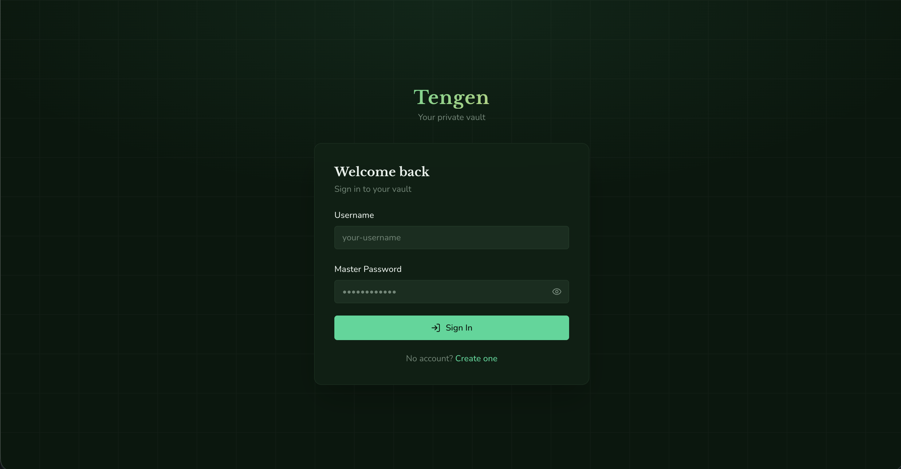
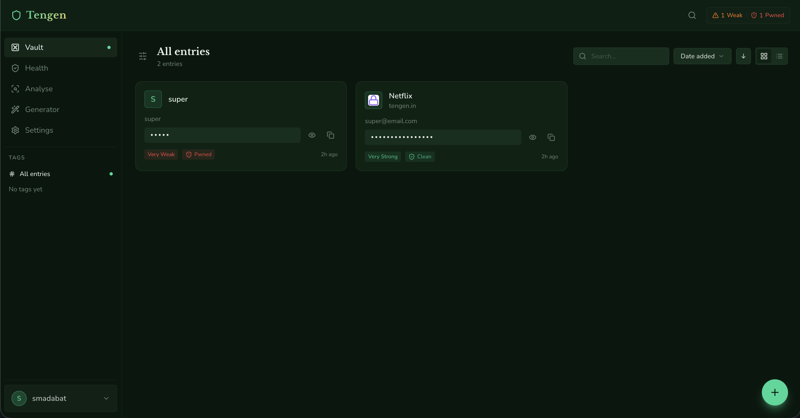
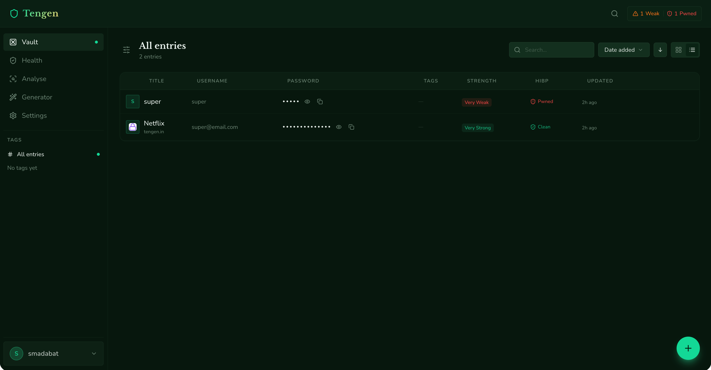
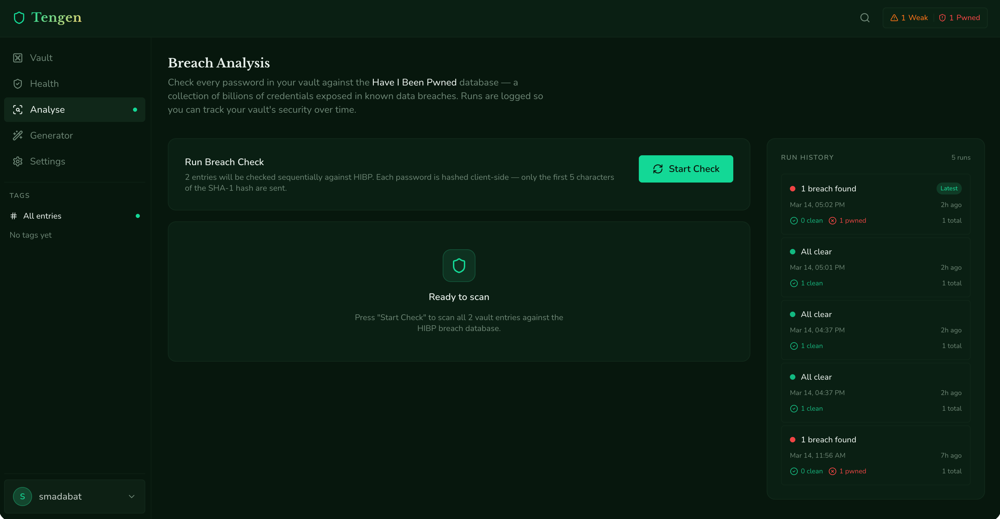
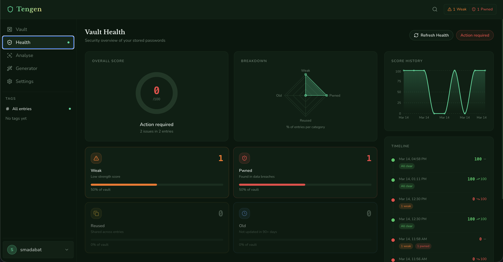
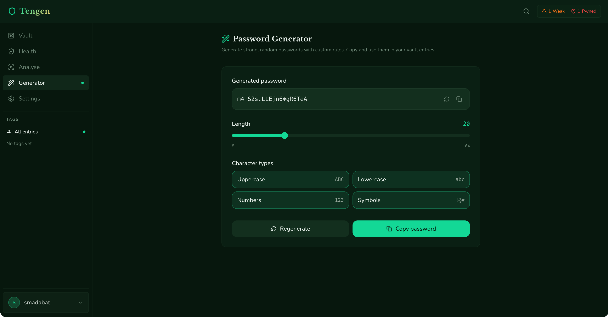
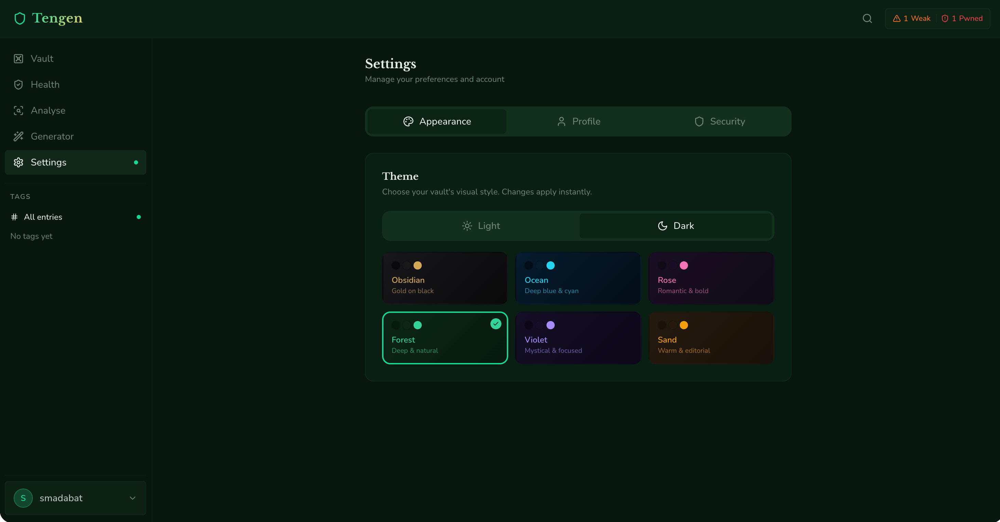

<div align="center">


# Tengen

**"I have been maintaining barriers for over 1000 years. Your passwords deserve the same."**

*A self-hosted, end-to-end encrypted password vault.*

[](LICENSE) [](https://fastapi.tiangolo.com) [](https://react.dev) [](https://docs.docker.com/compose/)

[Features](#features) · [Quick Start](#quick-start) · [Architecture](#architecture) · [API](#api-reference) · [Roadmap](roadmap.md) · [Changelog](CHANGELOG.md)

</div>

---

## What is Tengen?

Tengen Gojo — wait, wrong show. Tengen, the immortal barrier master of Jujutsu Kaisen, has been maintaining impenetrable barriers for over a thousand years. We thought that was a solid metaphor for a password manager.

Tengen is an open-source, self-hosted password manager. No clouds. No telemetry. No "we take your privacy seriously" emails after a breach. Just your passwords, your machine, and a barrier that's been holding for a millennium.

All vault entries are encrypted with **AES-256-GCM** before they touch the database — the server never sees a plaintext password. Your encryption key is derived from your master password, lives only in a short-lived in-memory session cache, and is purged on logout or inactivity. Like Tengen himself, it leaves no trace.

> ⚠️ Unlike Tengen, your master password is **not immortal**. If you forget it, your vault is gone. No recovery. No reset. Write it down somewhere safe (ironic, we know).

---

## Features

| Category | What's included |
|---|---|
| **Vault** | Create, read, update, delete password entries · username, password, URL, notes, tags |
| **Encryption** | AES-256-GCM per entry · fresh random 96-bit IV per write · ciphertext never leaves server |
| **Key derivation** | Argon2id (raw mode) for both authentication hash and AES-256 encryption key derivation — memory-hard, GPU-resistant |
| **Breach detection** | HaveIBeenPwned k-anonymity check · only SHA-1 prefix sent, never the full password · auto-checked on create/update · manual on-demand · batch scan all entries |
| **Password health** | zxcvbn strength scoring · vault-wide health dashboard · score history with area chart · tracks weak / pwned / reused / old passwords |
| **Password generator** | Cryptographically random · configurable length, charset, symbols |
| **Search & filter** | Inline search · tag filter · sort by date added / last updated / title |
| **Command palette** | `Cmd/Ctrl+K` global search · open entry, jump to tag, navigate pages |
| **Session security** | Auto-lock on inactivity · logout clears in-memory key · session tokens in `sessionStorage` only |
| **Themes** | Light / Dark / System — persisted per user |
| **Self-hosted** | Single `docker-compose up` · no telemetry · no external dependencies except HIBP |

---

## Preview

<p align="center">
  
</p>

<p align="center">
  
  
</p>

<p align="center">
  
  
</p>

<p align="center">
  
  
</p>

---

## Quick Start

> Tengen spent 1000 years setting up his barrier. You get 2 minutes.

### Prerequisites

- [Docker](https://docs.docker.com/get-docker/) + [Docker Compose](https://docs.docker.com/compose/) v2

### 1 — Clone & configure

```bash
git clone https://github.com/your-username/tengen.git
cd tengen
cp .env.example .env          # edit SECRET_KEY before going to production
```

### 2 — Start

```bash
docker-compose up --build -d
```

| Service | URL |
|---|---|
| Frontend | http://localhost:3000 |
| Backend API | http://localhost:3000/api |

### 3 — Stop

```bash
docker-compose down
```

> **Data persistence** — the SQLite database is stored in `./data/tengen.db` (mounted as a volume). It survives container restarts. Back it up like your life depends on it — because your passwords do.

---

## Configuration

All configuration is done via environment variables in `.env`.

| Variable | Default | Description |
|---|---|---|
| `SECRET_KEY` | *(required)* | JWT signing secret — change this before deploying, "secret" is not a secret |
| `ACCESS_TOKEN_EXPIRE_MINUTES` | `60` | JWT TTL |
| `ARGON2_TIME_COST` | `3` | Argon2id iterations |
| `ARGON2_MEMORY_COST` | `65536` | Argon2id memory (KB) |
| `ARGON2_PARALLELISM` | `2` | Argon2id parallelism |
| `DATA_DIR` | `/app/data` | SQLite database directory |
| `LOG_DIR` | `/app/logs` | Log file directory |
| `DEBUG` | `false` | Enable debug logging — keep this off in production unless you enjoy pain |

---

## Architecture

> Tengen's barrier technique works in layers. So does ours.

```
┌─────────────────────────────────────────────────────┐
│  Browser                                             │
│                                                      │
│  React 18 + Vite                                     │
│  TanStack Router · React Query · Zustand             │
│  Tailwind CSS · Framer Motion · Radix UI             │
└──────────────────────┬──────────────────────────────┘
                       │  HTTP (Nginx reverse proxy)
┌──────────────────────▼──────────────────────────────┐
│  FastAPI (Uvicorn)                                   │
│                                                      │
│  auth/   vault/   tools/   core/                     │
│  ├─ JWT + Argon2id auth                              │
│  ├─ AES-256-GCM encryption service                  │
│  ├─ HIBP k-anonymity client (httpx async)           │
│  ├─ zxcvbn password strength                        │
│  └─ In-memory session key cache (the barrier)       │
│                                                      │
│  SQLAlchemy ORM → SQLite (WAL mode)                  │
└─────────────────────────────────────────────────────┘
```

### Security model

1. **At rest** — every entry's password, username, and notes are AES-256-GCM encrypted. The encryption key is never written to disk. Ever.
2. **Authentication** — master passwords are hashed with Argon2id, the current gold standard for password hashing. Not bcrypt. Not MD5. Please not MD5.
3. **Key derivation & lifecycle** — Argon2id raw mode derives the 256-bit AES key from master password + stored salt on login (same algorithm used for the auth hash, same tunable env params). The key is never stored — it lives only in a TTL session cache and is purged on logout or expiry.
4. **HIBP privacy** — only the first 5 hex characters of `SHA1(password)` are sent to HaveIBeenPwned. The full hash and plaintext never leave your machine. This is called k-anonymity and it's clever.

---

## Project Structure

```
tengen/
├── backend/
│   ├── auth/               # Registration, login, JWT
│   ├── vault/              # Entry CRUD + AES-256-GCM encryption
│   ├── tools/              # Generator, strength, HIBP, health
│   ├── core/               # Config, security, logger, session cache
│   ├── models.py           # SQLAlchemy ORM models
│   ├── schemas.py          # Pydantic request/response schemas
│   ├── database.py         # DB session factory + WAL setup
│   ├── main.py             # FastAPI app factory + lifespan
│   └── requirements.txt
├── frontend/
│   ├── src/
│   │   ├── api/            # Axios client + API modules
│   │   ├── components/     # Layout, vault, UI primitives
│   │   ├── pages/          # Vault, Health, Analyse, Generator, Settings
│   │   ├── store/          # Zustand auth store
│   │   ├── hooks/          # useAutoLock, useClipboard
│   │   └── router.jsx      # TanStack Router route tree
│   ├── public/
│   │   └── icon.svg        # The barrier itself
│   ├── Dockerfile
│   └── nginx.conf
├── backend/Dockerfile
├── docker-compose.yml
└── .env.example
```

---

## API Reference

All protected endpoints require `Authorization: Bearer <token>`.

### Auth

| Method | Path | Description |
|---|---|---|
| `POST` | `/auth/register` | Create account |
| `POST` | `/auth/login` | Login, returns JWT |
| `POST` | `/auth/logout` | Invalidate session, purge encryption key from memory |

### Vault

| Method | Path | Description |
|---|---|---|
| `GET` | `/vault/entries` | List entries — supports `search`, `tag`, `sort`, `order` |
| `POST` | `/vault/entries` | Create entry (async HIBP check triggered) |
| `GET` | `/vault/entries/{id}` | Get single entry (decrypted) |
| `PUT` | `/vault/entries/{id}` | Update entry |
| `DELETE` | `/vault/entries/{id}` | Delete entry |
| `GET` | `/vault/tags` | List all tags for the authenticated user |

### Tools

| Method | Path | Description |
|---|---|---|
| `POST` | `/tools/generate` | Generate random password |
| `POST` | `/tools/strength` | zxcvbn strength score |
| `POST` | `/tools/hibp` | Manual HIBP check for an entry |
| `GET` | `/tools/health` | Vault health summary |
| `POST` | `/tools/health/snapshot` | Save health snapshot (60s dedup, keeps last 30) |
| `GET` | `/tools/health/history` | Health snapshot history |
| `POST` | `/tools/hibp/runs` | Save HIBP batch scan run (keeps last 20) |
| `GET` | `/tools/hibp/runs` | HIBP run history |

Interactive API docs available at `http://localhost:8000/docs` when running locally.

---

## Development

### Backend (without Docker)

```bash
cd backend
python -m venv .venv && source .venv/bin/activate
pip install -r requirements.txt
uvicorn main:app --reload --port 8000
```

### Frontend (without Docker)

```bash
cd frontend
yarn install
yarn dev          # Vite dev server on :5173
```

Set `VITE_API_BASE_URL=http://localhost:8000` if the backend is running locally.

---

## Roadmap / Changelog

- Roadmap: `roadmap.md`
- Changelog: `CHANGELOG.md`

## Contributing

Pull requests are welcome. The barrier grows stronger with every contributor.

1. Fork the repo and create a feature branch: `git checkout -b feat/my-feature`
2. Keep backend and frontend changes in separate commits where possible
3. For security-sensitive changes, please open an issue first to discuss the approach — we'd rather talk it through than merge a cursed technique into main
4. Run the backend with `uvicorn main:app --reload` and verify nothing breaks before opening a PR

---

## Security

Found a vulnerability? Please do not open a public issue. Instead, reach out directly so we can address it before disclosure. Details in [SECURITY.md](security.md).

---

## License

[AGPL-3.0](LICENSE) — free to use, modify, and self-host. If you run a modified version as a service, you must open source your changes. That's the binding vow.

---

<div align="center">
  <sub>Named after the immortal barrier master of Jujutsu Kaisen · Built with FastAPI · React · SQLite · ❤️</sub>
  <br/>
  <sub>Your passwords have been waiting for a barrier this strong.</sub>
</div>
